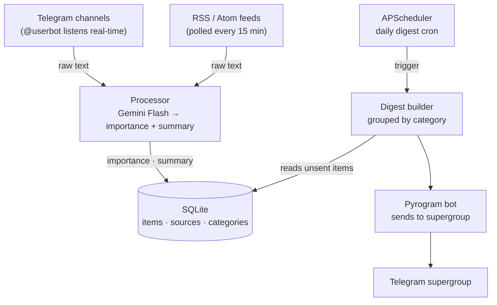

# TelegramSentinel

Personal AI news aggregator. Collects posts from Telegram channels and RSS feeds, classifies them by importance using Google Gemini, and delivers a clean digest to a Telegram supergroup.

## How it works



Each item goes through deduplication before processing. AI does exactly two things: assigns **high / low** importance and writes a one-sentence Ukrainian summary. Category is assigned to the source by the user, not by AI.

The digest is a single HTML message (split if > 4000 chars). High-importance items get summary + link; low-importance items get title + link only.

## Stack

| Layer | Tech |
|---|---|
| Collectors | Pyrogram (userbot), feedparser |
| AI | Google Gemini Flash (`gemini-2.0-flash`) |
| Storage | SQLite + aiosqlite |
| Scheduler | APScheduler |
| Bot | Pyrogram bot |
| Deploy | Docker + docker-compose (OCI ARM64) |

## Setup

### 1. Prerequisites

- Python 3.12+
- Telegram API credentials from [my.telegram.org](https://my.telegram.org)
- Telegram bot token from [@BotFather](https://t.me/BotFather)
- Google Gemini API key (free tier: 1500 req/day)

### 2. Install

```bash
git clone https://github.com/YouCanTrustMe/TelegramSentinel.git
cd TelegramSentinel
pip install -r requirements.txt
```

### 3. Configure

```bash
cp .env.example .env
# fill in all values in .env
```

### 4. Generate Pyrogram session (once, interactive)

```bash
python -c "
import asyncio
from pyrogram import Client
from src.config import settings

async def gen():
    async with Client('sessions/sentinel_userbot',
                      api_id=settings.telegram_api_id,
                      api_hash=settings.telegram_api_hash,
                      phone_number=settings.telegram_phone):
        print('Session saved.')
asyncio.run(gen())
"
```

### 5. Run

```bash
# local
python main.py

# Docker
docker compose up --build -d
```

## Bot commands

All commands are private (bot ignores messages from non-admin users).

```
/add_source <name> <@channel | url> <category>   — add Telegram channel or RSS feed
/remove_source <id>                               — remove source by id
/list_sources                                     — show all active sources

/add_category <name> <emoji>                      — add digest category
/remove_category <name>                           — remove category
/list_categories                                  — list categories

/schedule <HH:MM>                                 — change daily digest time (live, no restart)
/digest                                           — trigger digest immediately
/stats                                            — items collected in last 24h

/start                                            — show this help
```

## Project structure

```
main.py                              — entrypoint
src/
  config.py                          — pydantic-settings, single Settings instance
  scheduler.py                       — APScheduler wrapper
  collectors/
    telegram_collector.py            — userbot real-time listener
    rss_collector.py                 — RSS poller (15 min interval)
  processor/
    classifier.py                    — Gemini API call → importance + summary
    deduplicator.py                  — message_id generation + duplicate check
  dispatcher/
    digest_builder.py                — builds and sends digest
    sender.py                        — Pyrogram bot send wrapper
  bot/
    commands.py                      — all admin bot commands
  db/
    models.py                        — all async DB helpers
    migrations/001_initial.sql       — schema
```

## Deployment (OCI Always Free)

ARM64 instance. Data and sessions are persisted in local volumes:

```yaml
volumes:
  - ./data:/app/data
  - ./sessions:/app/sessions
```

Generate the Pyrogram session locally first (step 4 above), copy `sessions/` to the server, then:

```bash
docker compose up -d
```

## License

MIT
